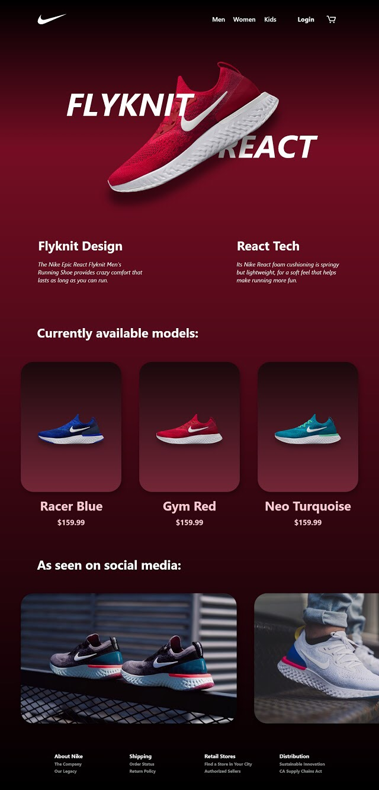
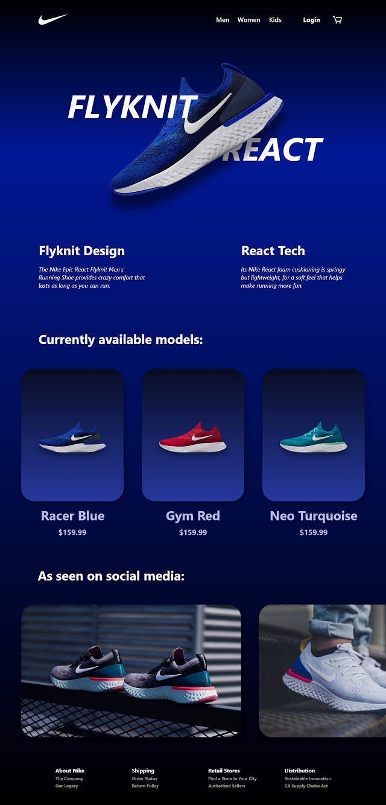
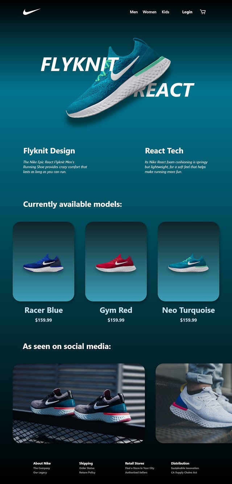

# Nike Flyknit React UI Design Project

## Project Description

This project is a user interface design showcasing Nike's Flyknit React running shoes. The design was created using Adobe XD and focuses on delivering a visually engaging experience by dynamically changing the background color to match the featured shoe model. The design highlights three different color variations of the Nike Flyknit React shoes and provides a smooth user interaction where the page adapts the primary background color based on the selected shoe. 

The goal was to create an immersive, brand-centric experience, where users could easily explore different models and colors while maintaining a consistent aesthetic with the Nike brand's design language.

## Features

- **Dynamic Background Color:** The background of the page changes color automatically to match the color of the highlighted shoe. For example:
  - **Burgundy** for the *Gym Red* model
	

	---

  - **Royal Blue** for the *Racer Blue* model
	

	---

  - **Turquoise** for the *Neo Turquoise* model
	

- **Product Highlights:** Each shoe is highlighted with key technical information such as:
  - Flyknit design details
  - Nike React technology for cushioning and comfort
- **Social Media Section:** A "As seen on social media" section that showcases how the shoe appears in real-life settings, emphasizing its appeal and functionality.
- **Mobile-first Design:** The user interface was designed with a mobile-first approach, prioritizing a seamless and intuitive experience on mobile devices.

## Tools Used

- **Adobe XD:** The entire user interface was designed using Adobe XD, ensuring a smooth workflow for layout, interaction design, and prototyping.

## Project Structure

The main sections of the design include:
1. **Header:** Navigation links for Men, Women, Kids, and user login/shopping cart functionalities.
2. **Hero Section:** A large central image of the highlighted shoe, accompanied by key descriptions (Flyknit Design, React Tech).
3. **Model Selection:** A gallery of currently available models with pricing information, allowing users to choose between different color options.
4. **Social Media Integration:** Visual representation of how the product looks on social media, creating a bridge between professional product shots and user-generated content.
5. **Footer:** Information about the brand, shipping details, store locations, and Nike’s commitment to sustainable distribution.

## How to Use

To navigate through the different models, users can click on each model's image to highlight the shoe. When a model is selected, the background automatically adjusts to reflect the main color of the shoe, creating a cohesive and immersive browsing experience.

- **Gym Red Model:** Background changes to Burgundy.
- **Racer Blue Model:** Background changes to Royal Blue.
- **Neo Turquoise Model:** Background changes to Turquoise.

## Author

**Emin A.**  
Full-Stack Software Engineering student at École 42, and a Bachelor's degree holder in User Interface Design.  
GitHub: [github.com/emayia](https://github.com/emayia)
